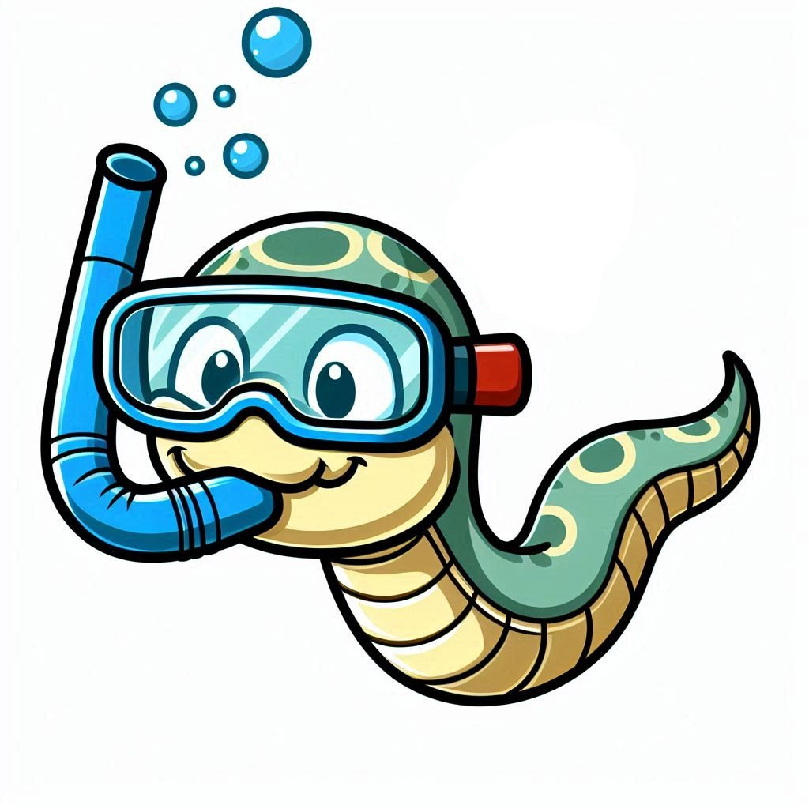

# CSnakes - a tool for embedding Python code into .NET projects

{ align=left width=30% }

CSnakes is a .NET Source Generator and Runtime that you can use to embed **Python** code and libraries into your **C#.NET Solution** at a performant, low-level without the need for REST, HTTP, or Microservices.

Check out the [getting started](getting-started.md) guide or check out the [demo solution](https://github.com/tonybaloney/CSnakes/tree/main/samples) to see more.

   

## Features

- .NET Standard 2.0 (.NET 6-9+)
- Supports Python 3.9-3.13
- [Supports Virtual Environments and C-Extensions](getting-started.md#using-virtual-environments)
- Supports Windows, macOS, and Linux
- [Tight integration between NumPy ndarrays and Spans, 2D Spans and TensorSpans (.NET 9)](buffers.md)
- Uses Python's C-API for fast invocation of Python code directly in the .NET process
- Uses Python type hinting to generate function signatures with .NET native types
- Supports [CPython 3.13 "free-threading" mode](advanced.md#free-threading-mode)
- Supports [nested sequence and mapping types (`tuple`, `dict`, `list`)](reference.md)
- Supports [default values](reference.md#default-values)

## Benefits

- Uses native Python type hinting standards to produce clean, readable C# code with minimal boiler plate!
- Integration between .NET and Python is done at the C-API, meaning strong compatibility between Python versions 3.8-3.13 and .NET 6-9.
- Integration is low-level and high-performance.
- CSnakes uses the CPython C-API and is compatible with all Python extensions.
- Invocation of Python code and libraries is in the same process as .NET

## Example

CSnakes will generate a C#.NET class for any Python file in a project that is tagged as CSharp Analyzer Additional File (see [Getting Started](getting-started.md)).
All functions in that class with type annotations will be reflected to callable C# methods and an environment builder added to that module.
